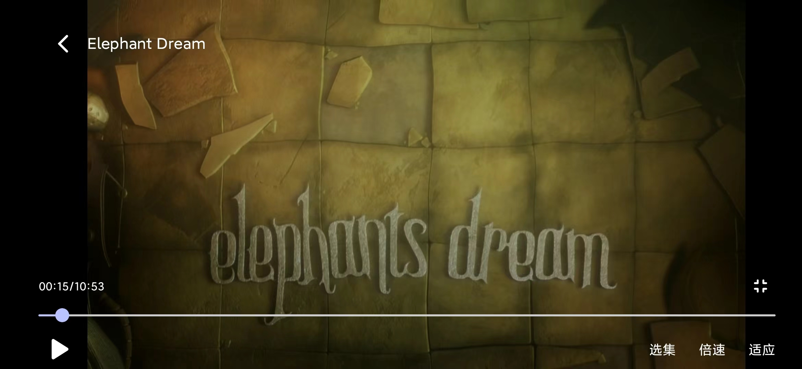

# Compose Video Player

一个视频播放器，使用Jetpack Compose基于Exoplayer进行的封装

## 简单使用

```kotlin
val playerState = rememberVideoPlayerState()

VideoPlayer(
    url = "http://commondatastorage.googleapis.com/gtv-videos-bucket/sample/ElephantsDream.mp4",
    playerState = playerState,
) {
    VideoPlayerControl(
        state = playerState,
        title = "Elephant Dream",
    )
}
```

更详细的使用参考[VideoPlayScreen](app/src/main/java/com/example/composevideoplayer/VideoPlayScreen.kt)

## 应用截图



## 参考开源

本项目是在[compose-video-player](https://github.com/imherrera/compose-video-player)的基础上进行开发的
